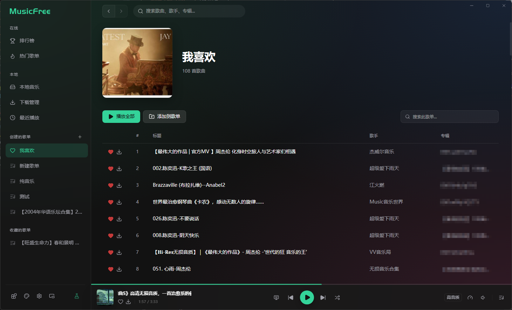
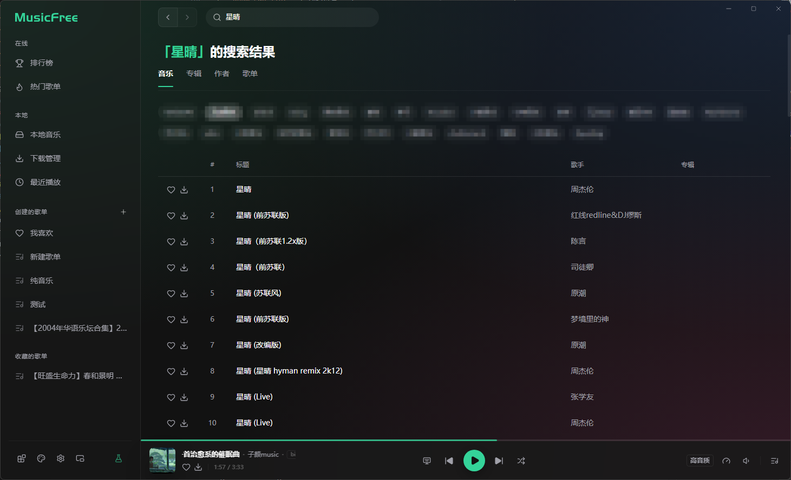
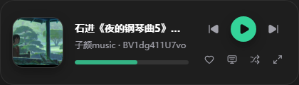

# MusicFree 桌面版（fork）
**[English](./README_EN.md)** | 简体中文

[原版：](https://github.com/maotoumao/MusicFree)https://github.com/maotoumao/MusicFree

 


(都是本体的数据)
<a href="https://trendshift.io/repositories/3961" target="_blank"></a>
---

> [!IMPORTANT]
> **项目使用约定**
>
> 本项目基于 [AGPL 3.0](./LICENSE) 协议开源，使用此项目时请遵守开源协议。
> 此外，希望你在使用代码时已了解以下额外说明：
> 1. 打包、二次分发**请保留代码出处**：https://github.com/maotoumao/MusicFree https://github.com/xugoudaob/MusicFree-desktopfork
> 2. 请不要用于商业用途，合法合规使用代码；
> 3.如果开源协议变更，将在上游 Github 仓库更新，不另行通知。
---

## 原readme以外的另行说明
这里的版本fork的是dev版，使用v1.0.0beta4的源码进行二次创作
**代码出处**：https://github.com/maotoumao/MusicFree \
我自己实在是受不了还未更新的版本（从三月等到了五月），自行做了一些更改
上游版本更新会尽快合并。。。 \
新版的release由于我还没参悟透Electrion神奇的打包机制，先发**即拆即用**的zip压缩包（我试过直接覆盖替换v1.0.0beta4的文件，结果可行，但不保证**卸载功能**可行） \
我自己没带MacOS的设备，故release优先发Windows系统的，Linux版等我参悟一下.deb包的打包和Pacman之类的再说。

## 启动项目

**nodejs**(至少大于v18)之后，在根目录下执行：
（另：写的是bash代码，实际上nodejs安装好了后cmd也能用，mac terminal未知）

```bash
# 克隆仓库
git clone https://github.com/maotoumao/MusicFreeDesktop.git
cd MusicFreeDesktop

#若无pnpm可选
#npm -g install pnpm

# 安装依赖
pnpm install

# 启动应用
pnpm start

# 开发模式（启用 Electron DevTools）
pnpm run dev
```
### 常用命令

| 命令 | 说明 |
| :---------------: | ---------- |
| `pnpm start` | 启动应用 |
| `pnpm run dev` | 开发模式 |
| `pnpm run make` | 构建安装包 |
| `pnpm run lint` | 代码检查 |
| `pnpm run format` | 代码格式化 |


## 简介

一个插件化、定制化、无广告的免费音乐播放器。
> 当前版本支持 Windows 和 Linux，macOS未进行测试


## 特性

- 插件化：本软件仅仅是一个播放器，本身**并不集成**任何平台的任何音源，所有的搜索、播放、歌单导入等功能全部基于**插件**。这也就意味着，**只要可以在互联网上搜索到的音源，只要有对应的插件，你都可以使用本软件进行搜索、播放等功能。** 关于插件的详细说明请参考 [安卓版 Readme 的插件部分](https://github.com/maotoumao/MusicFree#%E6%8F%92%E4%BB%B6)。

- 插件支持的功能：搜索（音乐、专辑、作者、歌单）、播放、查看专辑、查看作者详细信息、导入单曲、导入歌单、获取歌词等。

- 定制化：本软件可以通过主题包定义软件外观及背景，详见下方主题包一节。

- 无广告：基于 AGPL3.0 协议开源，将会保持免费。

- 隐私：软件所有数据存储在本地，本软件不会上传你的个人信息。

## 插件

插件协议和安卓版完全相同。
**插件支持的功能**：搜索（音乐、专辑、作者、歌单）、播放、查看专辑、查看作者详情、导入单曲、导入歌单、获取歌词、排行榜、推荐歌单、歌曲评论、多音质切换（标准 / 高品 / 超品 / 无损）。

[示例插件仓库](https://github.com/maotoumao/MusicFreePlugins)，你可以根据[插件开发文档](https://musicfree.catcat.work/plugin/introduction.html) 开发适配于任意音源的插件。

## 主题包

主题包是一个文件夹，文件夹内必须包含两个文件：

```bash
index.css
config.json
```

### index.css

index.css 中可以覆盖界面中的任何样式。你可以通过定义 css 变量来完成大部分颜色的替换，也可以查看源代码，根据类名等覆盖样式。

支持的 css 变量如下：

``` css
:root {
 --primaryColor: #f17d34; // 主色调
 --backgroundColor: #fdfdfd; // 背景色
 --dividerColor: rgba(0, 0, 0, 0.1); // 分割线颜色
 --listHoverColor: rgba(0, 0, 0, 0.05); // 列表悬浮颜色
 --listActiveColor: rgba(0, 0, 0, 0.1); // 列表选中颜色
 --textColor: #333333; // 主文本颜色
 --maskColor: rgba(51, 51, 51, 0.2); // 遮罩层颜色
 --shadowColor: rgba(0, 0, 0, 0.2); // 对话框等阴影颜色
 /** --shadow: // shadow属性 */
 --placeholderColor: #f4f4f4; // 输入区背景颜色
 --successColor: #08A34C; // 成功颜色
 --dangerColor: #FC5F5F; // 危险颜色
 --infoColor: #0A95C8; // 通知颜色
 --headerTextColor: white; // 顶部文本颜色
}
```

具体的例子可以参考 [暗黑模式](https://github.com/maotoumao/MusicFreeThemePacks/blob/master/darkmode/index.css)

除了通过 css 定义常规样式外，也可以通过在 config.json 中定义 iframes 字段，用来把任意的 html 文件作为软件背景，这样可以实现一些单纯用 css 无法实现的效果。

### config.json

config.json 是一个配置文件。

```json
{
 "name": "主题包的名称",
 "preview": "#000000", // 预览图，支持颜色或图片；
 "description": "描述文本",
 "iframes": {
 "app": "http://musicfree.catcat.work", // 整个软件的背景
 "header": "", // 头部区域的背景
 "body": "", // 侧边栏+主页面区域的背景
 "side-bar": "", // 侧边栏区域的背景
 "page": "", // 主页面区域的背景
 "music-bar": "", // 底部音乐栏的背景

 }
}
```

如果需要指向本地的图片，可以通过 ```@/``` 表示主题包的路径；preview、iframes、以及 iframes 指向的 html 文件都会把 ```@/``` 替换为 ```主题包路径```。详情可参考 [樱花主题](https://github.com/maotoumao/MusicFreeThemePacks/tree/master/sakura)

### 主题包示例

示例仓库：https://github.com/maotoumao/MusicFreeThemePacks

几个主题包(截图文件没了，没办法)：
暗黑模式[源代码](https://github.com/maotoumao/MusicFreeThemePacks/tree/master/darkmode)
背景图片[源代码](https://github.com/maotoumao/MusicFreeThemePacks/tree/master/night-star)
fliqlo[源代码](https://github.com/maotoumao/MusicFreeThemePacks/tree/master/fliqlo)
樱花[源代码](https://github.com/maotoumao/MusicFreeThemePacks/tree/master/sakura)
雨季[源代码](https://github.com/maotoumao/MusicFreeThemePacks/tree/master/rainy-season)


## 支持这个项目

如果你喜欢这个项目:)

1. Star [原项目](https://github.com/maotoumao/MusicFreeDesktop)，分享给你身边的人；
2. 关注公众号【一只猫头猫】获取最新信息；


## 🤝 参与贡献

欢迎参与贡献！请阅读 [贡献指南](./CONTRIBUTING.md) 了解开发规范与提交流程。

## 📸 截图

#### 主页



#### 搜索



#### 插件管理


#### 主题广场


#### 设置


#### 迷你模式

<div align="center">




</div>


---
>下面的摘自上游代码的dev,我实在是塞不进上面的README了，就放着吧，以后再来看看能不能塞上去
---
## 🔌 插件

MusicFree 的核心能力由插件驱动。插件协议与 [安卓版](https://github.com/maotoumao/MusicFree) 保持兼容，桌面版在此基础上扩展了更多能力。

### 插件仓库

- **示例插件**：[MusicFreePlugins](https://github.com/maotoumao/MusicFreePlugins)
- **开发文档**：[插件开发指南](https://musicfree.catcat.work/plugin/introduction.html)

### 插件能力一览

```
搜索 ─── 音乐 / 专辑 / 作者 / 歌单
播放 ─── 多音质切换 · 音源重定向
内容 ─── 专辑详情 · 作者作品 · 歌词 · 歌曲评论
发现 ─── 排行榜 · 推荐歌单 · 歌单分类
导入 ─── 单曲导入 · 歌单导入
```

### 插件沙箱

插件运行在安全沙箱中，可使用以下内置模块：

`axios` · `cheerio` · `dayjs` · `big-integer` · `qs` · `he` · `crypto-js` · `webdav`

---

## 🎨 主题包

MusicFree 支持通过主题包自定义界面外观。内置两套主题：**浅色** 和 **纯黑（AMOLED）**。

### 主题包结构

一个主题包是一个文件夹（或 `.mftheme` 压缩包），包含以下文件：

```
my-theme/
├── config.json # 主题配置（必需）
├── index.css # 样式定义（必需）
├── preview.png # 预览图（可选）
└── iframes/ # iframe 背景（可选）
 └── app.html
```

### config.json

```jsonc
{
 "name": "主题名称", // 必需
 "preview": "#000000", // 预览色或图片路径
 "description": "主题描述",
 "author": "作者",
 "authorUrl": "https://...",
 "version": "1.0.0",
 "srcUrl": "https://...", // 远程更新地址
 "thumb": "@/thumb.png", // 缩略图
 "blurHash": "LEHV6nWB2yk8pyo...", // 加载占位（BlurHash）
 "iframe": {
 "app": "@/iframes/app.html", // 软件整体背景
 },
}
```

> 路径中使用 `@/` 表示主题包根目录。

### index.css — 语义化 CSS 变量系统

新版采用 **语义化 CSS 变量** 设计，按视觉用途分为六大类。你可以在 `index.css` 中覆盖这些变量来定义主题色彩：

| 分类 | 前缀 | 用途 | 示例 |
| :------: | :----------------: | ------------------------- | -------------------------------------------------- |
| **背景** | `--color-bg-*` | 页面、侧栏、弹窗等背景色 | `--color-bg-base`、`--color-bg-sidebar` |
| **填充** | `--color-fill-*` | 按钮、交互元素的填充色 | `--color-fill-brand`、`--color-fill-neutral-hover` |
| **文本** | `--color-text-*` | 各级文本颜色 | `--color-text-primary`、`--color-text-secondary` |
| **边框** | `--color-border-*` | 分割线、边框 | `--color-border-default`、`--color-border-subtle` |
| **状态** | `--color-status-*` | 信息 / 警告 / 危险 / 成功 | `--color-status-danger-text` |
| **阴影** | `--shadow-*` | 各级投影 | `--shadow-sm`、`--shadow-lg` |

> 完整变量列表请参考内置主题 [`res/builtin-themes/light/index.css`](./res/builtin-themes/light/index.css)。

### iframe 背景

通过 `config.json` 中的 `iframe.app` 字段，你可以将任意 HTML 页面设为软件背景，实现粒子、动画等纯 CSS 无法实现的效果。支持本地 HTML 文件和远程 URL。

